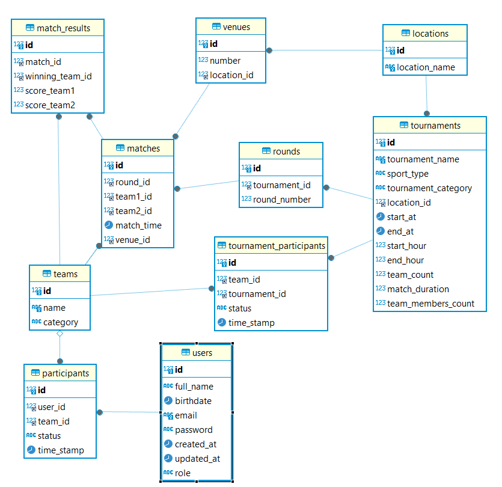

# Sports-Tournament-Organizer
Project for the Java Web Development course @ FMI

## Overview
The Sports Tournament Organizer is a platform designed to simplify the management of sports tournaments. It allows organizers to create and manage tournaments, schedule matches, track results. The platform provides secure authentication and profile management for participants, ensuring a smooth and efficient tournament experience.

## Features
### Tournament Creation and Management
- Create, Edit, and Delete Tournament Details: Easily manage the lifecycle of a tournament by adding, updating, or removing tournament information.
- Set Tournament Information: Configure essential details such as sport type, dates, locations, and rules.
- Manage team Registration: Handle team registration process seamlessly.
  Match Scheduling and Results Tracking
### Schedule Matches and Assign Venues: Organize matches and allocate venues efficiently.
- Update and Track Match Results and Team Standings: Keep track of match outcomes and maintain up-to-date standings.
### Participant and Team Management
- Register Participants and Manage Team Rosters: Simplify the registration process and maintain detailed team rosters.
- Categorize Teams and Participants: Classify teams and participants based on criteria such as amateur, professional, and youth.
- Send Tournament Schedules, Updates, and Results: Communicate important information through email or platform notifications.
### Advanced Business Requirements
- Participant Authentication and Profile Management: Ensure secure participant registration and login, and facilitate personal and team profile management.

To view all of the endpoints visit http://localhost:8080/swagger-ui/index.html#/ 

## Technologies used
- Backend: Java Spring Boot
- Frontend: React
- Database: MySQL
- Authentication: JWT (JSON Web Tokens)

## Database

## Getting Started
### Prerequisites
- Node.js and npm
- MySQL Server
- IDE (e.g., IntelliJ IDEA, Visual Studio Code)
### Installation and Setup
- Clone repository
~~~
git clone https://github.com/nataliaNikolova13/Sports-Tournament-Organizer
~~~
- Run through IntelliJ
- Create a database with the credentials in the application properties
### Setup Frontend
~~~
cd sport-tournament-frontend/sport-frontend
~~~
~~~
npm install 
~~~
~~~
npm run dev
~~~

## Running the Application
### Frontend 
- Can be accessed through http://localhost:5173
### Backend
 - The backend API will be running at http://localhost:8080
### Testing 
 - The backend API can be tested through Postman 
 - Or through Swagger http://localhost:8080/swagger-ui/index.html#/ 